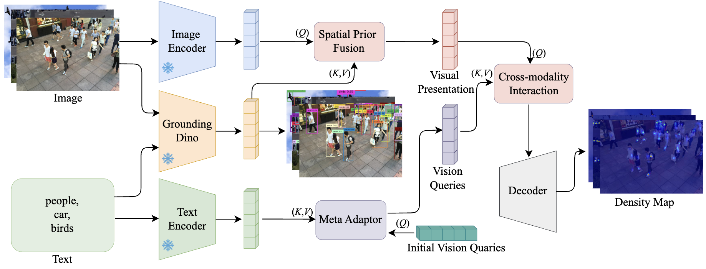
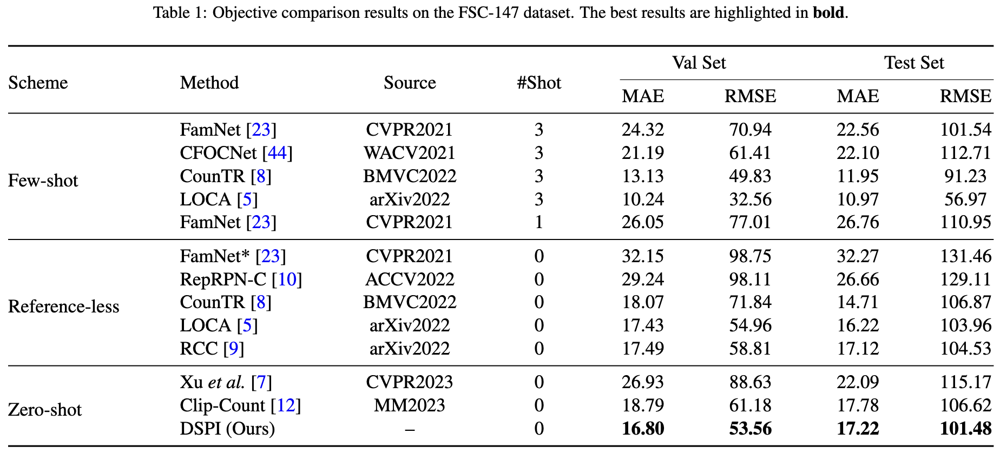
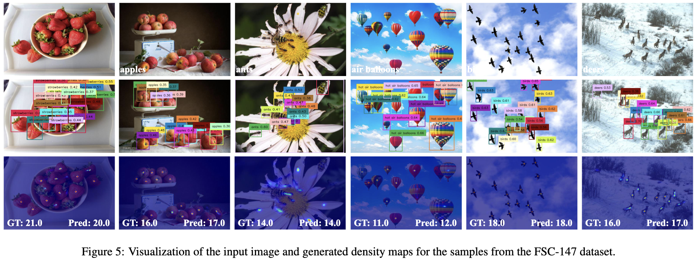

# Towards Zero-shot Object Counting via Deep Spatial Prior Cross-modality Fusion

This repository contains the code and resources associated with our paper titled "Towards Zero-shot Object Counting via Deep Spatial Prior Cross-modality Fusion". Please note that the paper is currently under review for publication.

The code is tested on Ubuntu 22.04 environment (Python3.8.18, PyTorch1.10.0) with an NVIDIA GeForce RTX 3090 Ti.

## Contents

- [Towards Zero-shot Object Counting via Deep Spatial Prior Cross-modality Fusion](#towards-zero-shot-object-counting-via-deep-spatial-prior-cross-modality-fusion)
  - [Contents](#contents)
  - [Introduction](#introduction)
  - [Train](#train)
  - [Test](#test)
  - [Pretrained Weights](#pretrained-weights)
  - [Results](#results)
    - [Quantitative Results](#quantitative-results)
    - [Visual Results](#visual-results)
  - [Citation](#citation)
  - [Acknowledgements](#acknowledgements)

## Introduction

The Deep Spatial Prior Interaction (DSPI) network leverages the spatial-awareness ability of large-scale pre-trained object grounding models, suchas Grounding DINO, to incorporate spatial location as an additional prior for a specific query class. This enablesthe network to be more specifically focused on the precise location of the objects. Additionally, to align the featurespace across different modalities, we tailor a meta adaptor that distills textual information into an object query, whichserves as an instruction for cross-modality matching. These two modules collaboratively ensure the alignment ofmulti-modal representations while preserving their discriminative nature. Comprehensive experiments conductedon a diverse set of benchmarks verify the superiority of the proposed model.



## Train

1. Download FSC-147 Dataset from [HERE](https://1drv.ms/f/s!As_uFI5TMRIPiL4vHLLbEuzx32IZsw?e=RC4dcC).
2. Modify `scripts/train.sh` to specify your own train options.
3. After performing the above modifications, you can start the training process by running `bash scripts/train.sh`.

## Test

1. Modify `scripts/test.sh` to specify your own test options.
2. After performing the above modifications, you can start the testing process by running `bash scripts/test.sh`.

## Pretrained Weights

The pretrained weights from [HERE](https://1drv.ms/f/s!As_uFI5TMRIPiL4wGSMrDSg8u0BZGw?e=LT9LNK).

## Results

### Quantitative Results



### Visual Results



## Citation

If you find this code or research helpful, please consider citing our paper:

```BibTeX
@article{Chen2024DSPI,
title={Towards Zero-shot Object Counting via Deep Spatial Prior Cross-modality Fusion},
author={Chen, Jinyong and Li, Qilei and Gao, Mingliang and Zhai, Wenzhe and Camacho, David and Jeon, Gwanggil},
journal={under_review}
year={2024},
}
```

Please note that this citation is a placeholder and will be updated with the actual citation information once the paper is accepted and published. We kindly request you to revisit this section and replace the placeholder with the correct citation detail.

## Acknowledgements

This code is built on [CLIP-Count](https://github.com/songrise/CLIP-Count) and [GroudingDINO](https://github.com/IDEA-Research/GroundingDINO/tree/main). We thank the authors for sharing their codes.
